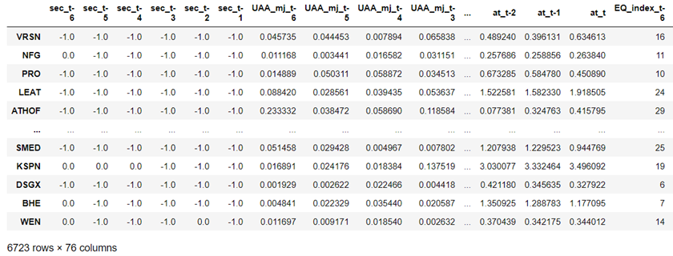

### Executive Summary

Financial reporting is a fundamental aspect of a company's operations, providing essential information for stakeholders,
including investors, regulators, and management. The accuracy and reliability of financial statements are critical to the
decision-making process, as they provide insights into a company's performance, financial position, and cash flows. Despite
stringent regulatory requirements and oversight, financial restatements - the revision of previously issued financial
statements due to errors, omissions, or misrepresentations - continue to occur, eroding investor confidence and potentially
leading to adverse consequences for companies.

This project presents a novel approach to predicting financial statement restatements using machine learning techniques
and a comprehensive set of financial metrics, ratios, and other indicators. By leveraging publicly available information from
the Wharton Research Data Services (WRDS) database, this study aims to develop a predictive model that can effectively
identify companies at risk of restating their financial statements, thus serving as an indicator of reporting quality.

The importance of this research lies in its potential to enhance the existing tools and methodologies used by stakeholders
to assess the reliability of financial statements. By predicting the likelihood of restatements, the proposed model can assist
investors in making more informed decisions, regulators in allocating resources for enforcement and oversight, and
management in identifying potential issues within their reporting processes. Moreover, the integration of machine learning
techniques in this context contributes to the growing body of literature at the intersection of finance and artificial
intelligence, showcasing the potential of advanced computational methods in addressing complex financial challenges.

### Data Collection, Evaluation, Preprocessing and Storage

#### The calculateFinancials() Function

In order to facilitate the process of extracting the financial information needed from the WRDS Compustats database, we first created a function to calculate the key financial metrics of a company within a certain timeframe. These indicators include:

1.	UAA scores of a company, using the Modified Jones Model - Earnings quality indicator
2.	UAA scores of a company, using the Teoh et al Model - Earnings quality indicator
3.	UAA scores of a company, using the Dechow and Dichev Model - Earnings quality indicator
4.	Annual percentage change of the stock price - Market indicator
5.	Earnings yield - Market indicator. Use earnings yield instead of P/E to avoid division by 0
6.	Current ratio - Liquidity indicator
7.	Debt to equity - Solvency indicator
8.	Return on equity (ROE) - Profitability indicator
9.	Asset turnover - Efficiency indicator

The function will return a dataframe with 9 columns where each column represents a financial metrics above. Number of rows would depend on the number of years evaluated.

Here is the function’s sample output tested using Google and a evaluation period of 2012 to 2021:

 

#### The Restatement Data and The Combined Dataset

In order to evaluate the relationship between earning quality scores and the restatement status of a company’s financial statements, we need to acquire the restatement information from the WRDS Auditor’s Analytics database and add it to our financials data. This variable will be later used as our target variable. 

Since some restatements were SEC investigated, we also want to know if SEC investigation can serve as a statistically significant indicator of the earning quality. To acquire this information, we used the res_begin_date, res_end_date and res_sec_invest variables from the WRDS Auditor’s Analytics database. We use a value of -1 to indicate that there was no restatement in a particular year, 0 to indicate that there was a restatement but not SEC investigated and 1 to indicate that this restatement was a SEC investigated restatement.

Since we are using an evaluation period of 2012 to 2022, we looped through all the companies that existed during this period, and combined the restatement information with the financials information calculated using the calculateFinancials() function (stacking and transposing rows into columns to make every company a single row.)

Here is the data description of our final dataset

In our dataset, each row is a company. The dataframe’s index is the company’s ticker.
There are 100 columns. each 10 columns represent a variable from year 2012 to 2021
E.g., The first 10 columns indicates whether if there was a restatement in each year from 2012 to 2021. A value of -1 means there was no restatement, a value of 0 means there was a restatement and a value of 1 means the restatement was a SEC investigated restatement.

Here is the complete list of data description:
column 1-10 (sec): As explained above
column 11-20 (UAA_mj): UAA score using modified jones model
column 21-30 (UAA_teoh): UAA score using Teoh et al Model
column 31-40 (UAA_dd): UAA score using Dechow and Dichev Model
column 41-50 (pct_price_change): Percentage change of the stock price during the year
column 51-60 (ey): Earnings yield
column 61-70 (cr): Current ratio
column 71-80 (dte): Debt to equity
column 81-90 (roe): Return on equity
column 91-100 (at): Asset Turnover

What the final dataset looks like:

### Correlation Analysis Between Earning Qualities and Financial Restatements

Now we have all our data conveniently in one single dataset, first let's take a look at the relationship between UAA scores and restatements. Do restated periods have higher UAA scores (Lower earning quality)? We will be performing our tests using the UAA score calculated with Dechow and Dichev Model.

The first thing we need to do is to flatten our dataset, so all years' data are combined into the same column. After flattening, there will be 2 columns, the first one indicates if a company restated its financial statements or not, if yes, what type of restatement. The second column indicates the company's UAA score of that year. 

What the flattened dataset looks like:

In order to test the relationship between EQ scores and both regular restatements and SEC investigated restatements, we need to create 2 different binary dataframes:

1.	The All Restatement Dataframe indicates whether if a company restated its financial statements (0 for no and 1 for yes)
2.	The SEC Restatement Dataframe indicates whether if a company restated its financial statements due to a SEC investigation (0 for did not restate or not due to SEC investigation and 1 for restated and due to SEC investigation)

Some visualization of the UAA scores by restatement status

Since the dataset is not balanced, the visualisation is not very useful, especially for the SEC investigated restatements as the number is very small comparing to the number of observations with no restatement.

#### The Hypothesis Tests

1-sided hypothesis test (Difference in mean) using all restatements:

Null Hypothesis: UAA scores of restated years are not higher than those of non-restated years
Alternative Hypothesis: UAA scores of restated years are higher than those of non-restated years

t-statistic: 1.9648344047367838
p-value: 0.02472551542882908

A p value of 2.5% indicates strong evidence that the UAA scores of the restated companies tend to be higher.

1-sided hypothesis test (Difference in mean) using SEC restatements:

Null Hypothesis: UAA scores of SEC investigated restated years are not higher than those of non-restated years and non SEC investigated restated years
Alternative Hypothesis: UAA scores of SEC investigated restated years are higher than those of non-restated years and non SEC investigated restated years

t-statistic: -0.6822749389731764
p-value: 0.752462404076568

We got a negative t stat as well as a P value of 0.75, which indicated that there is no evidence that those who restated their financial statements due to SEC investigations tend to have a higher UAA score (lower EQ). This inconsistency with the previous test where all restatements were used may be due to several reasons such as the extremely imbalanced dataset and a very small number for the SEQ investigated restatements.

### Calculation and Explanation of Additional Earning Management Predictors

It seems that firms that restated their financial statements do have a lower earnings quality. Because of this, it might be possible to use the UAA score as well as other financial metrics to predict if a company will restate its financial statements or not in the future. If the likelihood of restatement is high, there is a very likely that the current financial statement is of low quality and is subject to earnings management.

Let us build a predictive model to detect this. First of all, besides the UAA score (which indicates the abnormal accruals) that we have just tested, we should also include several other commonly used financial indices that might also help to detect earning management. All the indices will be initially included as predictors as we will try to include as many features as possible to minimize the risk of omitted variable bias and then performs feature reduction to remove the not important ones. All of these features have already been extracted during the ETL process.

Additional features to include:

Market indicators: Annual Percentage Stock Price Change and Earnings Yield
Liquidity indicator: Current Ratio
Solvency indicators: Debt to Equity
Profitability indicator: Return on Equity
Efficiency indicators: Asset Turnover
Model design: We will be using the financial information (UAA scores, Annual stock price change, Earnings Yield, Current Ratio, Debt to equity, ROE and Asset Turnover) from year t-6 to year t to evaluate the financial statement quality of year t

### Training, Tunning, and Testing of Machine Learning Models

Let us assume that we are in year 2018 and the company just issued its financial statements. This model will be trying to predict if the newly released financial statement is subject to earnings management and will be restated in the future. We will be predicting this using the financial statement information from year 2012 to 2018.

We first need to make sec_2018 our target variable and change it to binary format with all restatement (0 for no restatement and 1 for restatement, regardless of SEC investigated or not)

A quick look of our training dataset

Correlation Matrix

 
Now let's try a few prediction models to see the performance. 

1.	Logistic Regression
2.	K Nearest Neighbor (KNN)
3.	Classification And Regression Tree (CART)
4.	Random Forest
5.	Support Vector Machine (SVM)

All models were fine tuned using grid search and cross validation to find the best hyperparameters to use. The training and testing data were normalized for all distance based algorithms such as KNN and SVM. 

Here are the fine tuned hyper-parameters by model:

KNN: k: 18
CART: max_depth: 1, min_samples_split: 2
Random Forest: max_depth: 20, min_samples_leaf: 2, min_samples_split: 10, n_estimators: 10
SVM: Radial Basis Function kernel function, regularization parameter of 10 and a scale gamma

Here is the testing performance:

As we can see from the graph, the SVM classifier clearly outperforms the other classification models, using the Radial Basis Function kernel function, regularization parameter of 10 and a scale gamma.

### Evaluation of Feature Importance

Since we cannot assume the linear relationships between our predictors and target variable, using lasso regression to perform feature reduction may be biased. Thus, we will use decision tree and entropy to evaluate what are the most important predictors.

Here is the unpruned decision tree

Based on this tree, we evaluated the entropy, or the information gain, and ranked the most important features:

As expected, the most important indicator of the current year's reporting quality is the restatement status of the previous year, since restatements usually happen in a consecutive year. However, this feature might not be as useful as it looks, because when we are evaluating the earnings quality of a particular year, the previous year's statement might not have been restated yet, even if it has potential problems.

Now the question is, should we exclude it?

Although, on one hand, it is true that including this variable may lead to certain degree of information leakage, the benefit of keeping it outweigh the potential biases as many restatement were filed in the same financial year or in the next, so there is a very high likelihood that we will have the information on whether if the previous year’s financial statements were restated or not, when evaluating the current year's earnings quality, and if we do, our model should be able to capture that since it is a very strong indicator on the current year's restatement probability. The worst-case scenario is that when evaluating the current year's financial statement quality, the previous year’s statements have not been restated yet, do they do have problems. In this case, the value that we will be using is 0 for previous years restatement status, and the model will continue to use other predictors to make predictions as usual, so there will be very minimal bias.

On the other hand, if we exclude this variable, and when we do have the information on the previous year’s restatement status when evaluating the current year's financial quality, our model will not be able to capture that information, and our model will have a major omitting variable bias.

The second important feature is the modified jones based UAA score of 2015, followed by 3 teoh based UAA scores. Overall, most of these factors contribute to our predictive model, and should not be removed.

### Model Testing: Predicting 100 Companies with Highest Risks

Now let's evaluate our model using the reserved data from year 2019 to 2021. Since our training data used to predict the earning quality of year t is the financial data from year t to t - 6, we also need to use 7 years of data to test. For instance, to predict the earning quality of year 2019, we will need to use the financial data from 2013 to 2019 as X test. Similarly, to predict the EQ of year 2020 and 2021, we will be using data from 2014 to 2020, and data from 2015 to 2021 respectively.

Since we are using the support vector machine model that we tuned earlier, the training data and the test data has to be scaled using the same scaler. After rescaling the data, we applied the SVM model using the Radial Basis Function kernel function, regularization parameter of 10 and a scale gamma . 

Here are the prediction results of the top 100 most risky companies of 2019, 2020 and 2021

2019:

2019 prediction accuracy:  0.9232142857142858  

2020:

2020 prediction accuracy:  0.9361607142857142

2021:

2021 prediction accuracy:  0.9535714285714286

The model accuracy is pretty high, but how about its precision? After all, we want to know if a company is flagged as a potential earning manager, how confident can we be? We evaluated this using the most suspected companies detected in the previous steps, and here is the result:

In 2019, if a firm is predicted to be of low earning quality, it has  43 % probability that it will restate its statement in the future

In 2020, if a firm is predicted to be of low earning quality, it has  40 % probability that it will restate its statement in the future

In 2021, if a firm is predicted to be of low earning quality, it has  33 % probability that it will restate its statement in the future

As we can see, although the precision is not as good as the total model accuracy, considering the huge imbalance in our dataset, the prediction result is still quite informative, and can be very useful if used as an additional indicator for the analyst when evaluating a certain company's financial statement quality.

### Improve Model Performance Through Data Segregation Using EM Index

Let's see if we can make a better prediction using EQ scores and decile segmentation on top of our ML prediction models. We will be testing it using the 2021 data and compare it with the result we got from the pure SVM model.

The following steps were taken:

1.	Assign decile index to each company based on the 3 UAA scores. A few functions such as percentileList() and assignDecile() were created to facilitate the process.
2.	Calculate decile using each of the 3 UAA models, and combined them to calculate an EQ index

Here is the out dataframe:

#### Hypothesis Test Using the Newly Created EQ_index

Now let's redo the hypothesis test, but this time with the newly created EQ_index

All restatement hypothesis test result:

t-statistic: 3.3753932122763226
p-value: 0.0003748399335032735

We saw a big improvement in the test's p value which decreased from the previous 2.5% to 0.02%. This shows that the EQ index is a much stronger indicator than the single UAA score for whether if the company's statement will be restated or not.

SEC investigated restatement hypothesis test result:

t-statistic: 1.6762619681446373
p-value: 0.04691324970388801

The p value was improved from the previous inconclusive 0.75 to 0.05, which again, proves that the EQ index is indeed a better indicator than one single UAA score. This also allows us to reject the null hypotheses with a confidence level of nearly 95% and proves that companies that restated due to SEC investigations do have, on average, a worse earning quality.

### Identify 5 Highest Risk Firms Using the New EM Index

Let us include this new index into our prediction model and see if we can improve our prediction results. The first thing we need to do is to calculate the EM index score for each year.

Note: Now we have 110 columns (10 more EM index scores)

Let us re-train our SVM model. This time, we will be training our model using data from 2012 to 2020.

Since our model's input is 7 years rolling window, we first need to prepare our training dataset by stacking 7 years of rolling window data on top of each other, so our columns become t-6, t-5, t-4, t-3, t-2, t-1 and t, instead of specific years. We will be using year 2012 to 2018 as the first rolling window, 13 to 19 as the second rolling window and 14 to 20 as the third rolling window. After stacking the 3 rolling windows and renaming the columns, our training dataset looks something like this:

Note that since each rolling window has 2241 rows, we now have 6723 rows after stacking them together.

After training and testing our model using the 2021 data as test data, the model accuracy has been improved from the previous 95% to 97%. Great success!

Now, let us wrap up our model and research by producing a list of 5 companies of which the financial statements are most likely to be restated due to potential earnings management in the year of 2021. We will first applying our new models to all companies in 2021 to narrow down our list to 10 companies with the highest risks.

Here is the top 10 companies list produced by the model with the highest risk of restating their 2021 financial statements:

Now, in order to narrow them down further, we will adopt some qualitative approach:

One of the strongest incentives for the management to engage in earning management is to avoid the reporting of a negative ROE in the current reporting year. A strong evidence of this is that the distribution curve of ROE scores usually dive just before the 0 benchmark point and spike back up immediately once over 0 as companies with close to 0 but negative ROE tries to manage their earnings up a little to make it positive. Thus, companies with just over 0 but positive ROEs are very likely to have engaged in earnings management.

The second qualitative factor we want to focus on is Auditor's Opinion. Auditor are trained to identify material misstatements, whether due to fraud or error, in the financial statements. A company with a history of clean audit opinions is generally considered to have a lower risk of earnings management than a company with a history of qualified, adverse, or disclaimed opinions.

The third qualitative factor we want to look at is market cap. Comparing to large-cap, mid-cap or even small-cap companies, micro-cap companies are more likely to engage in earning managements for several reasons.

1.	Pressure to meet expectations: Micro-cap companies are usually at an earlier stage of development and may face greater pressure to show profitability and growth to attract investors. This can lead to aggressive accounting practices, including manipulating earnings figures, to meet or exceed market expectations.
2.	Limited resources and expertise: smaller companies may not have the same level of resources or access to expertise as larger firms. This can result in less robust internal controls, making it easier for management to manipulate financial reports.
3.	Less scrutiny from regulators and auditors: Micro-cap companies typically receive less attention from regulatory agencies, financial analysts, and auditors due to their smaller size and lower market capitalization. This decreased scrutiny may provide more opportunities for earnings management to go unnoticed.
4.	Lower liquidity and trading volume: Micro-cap stocks often have lower trading volumes and less liquidity, which can lead to greater price volatility. Some managers might manipulate earnings to create a more favorable impression of the company and boost the stock price, taking advantage of the low liquidity.
5.	Incentive structures: Managers of micro-cap companies might be more likely to engage in earnings management if their compensation packages are tied to short-term performance metrics, such as earnings per share or stock price. These incentives could encourage managers to manipulate financial statements to achieve personal financial gains.
After evaluating the ROE, auditor's opinion, and market cap of all 10 companies, the following 5 companies were selected:

MMC WTW CMP WWE ESE

All 5 companies have restated their 2019 financial statements later.
